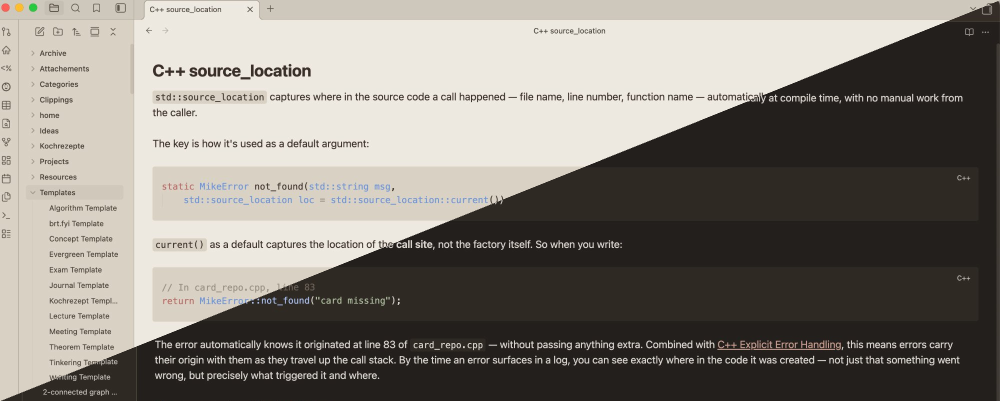

# Warm Springs

A warm, earthy Obsidian theme, inspired by Sonoma's images of the [Warm Springs farm](https://www.mazzocco.com/Our-Story/Vineyards/Warm-Springs-Ranch). 

Dark chocolate darks, cream lights, desaturated greens, muted rust and clay accents. Supports both light and dark mode.

"Dusty Rose" (rgb(166, 124, 109)) chosen as accent color on the screenshots. 

## Inspiration
MacOS Sonoma's Warm Springs Wallpapers, [Hamlindigo Blue](https://breakingbad.fandom.com/wiki/Hamlin,_Hamlin_%26_McGill) from Better Call Saul,  
## License

MIT © brtmax
